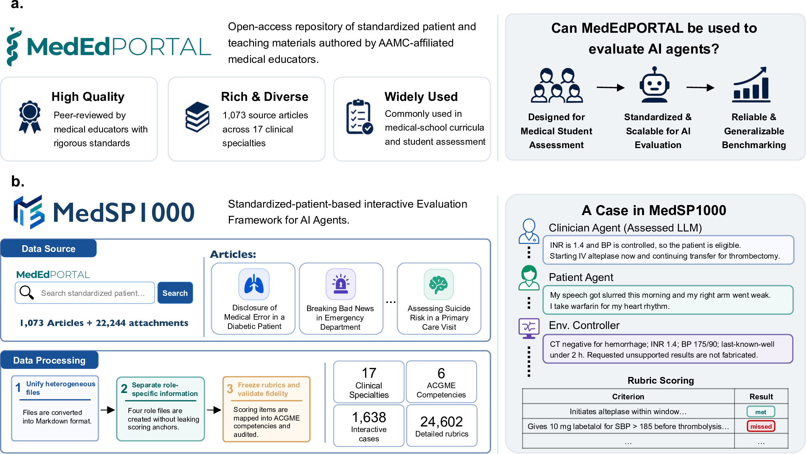
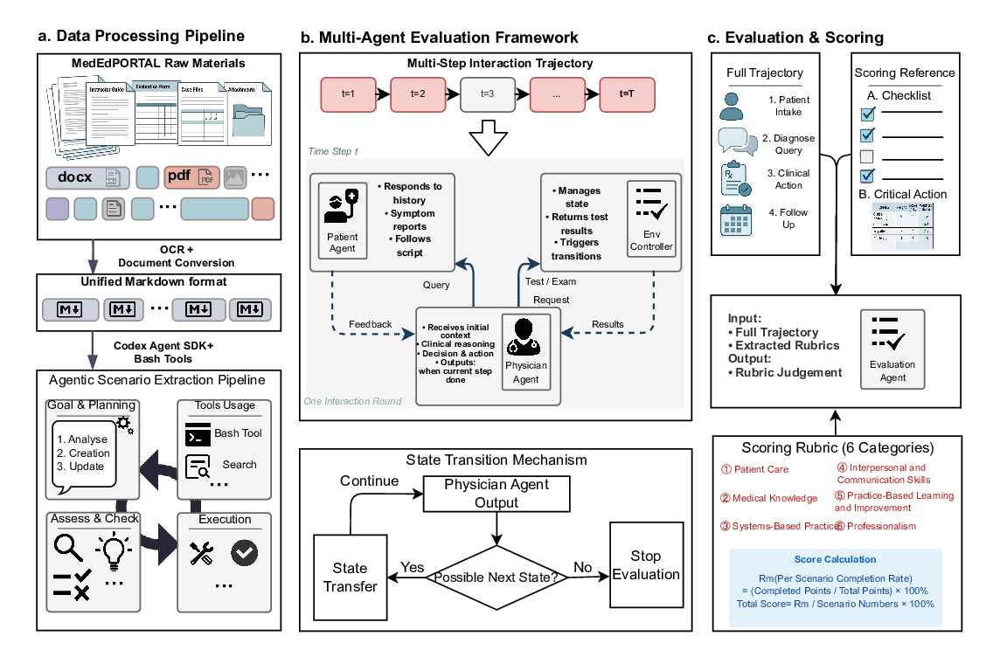
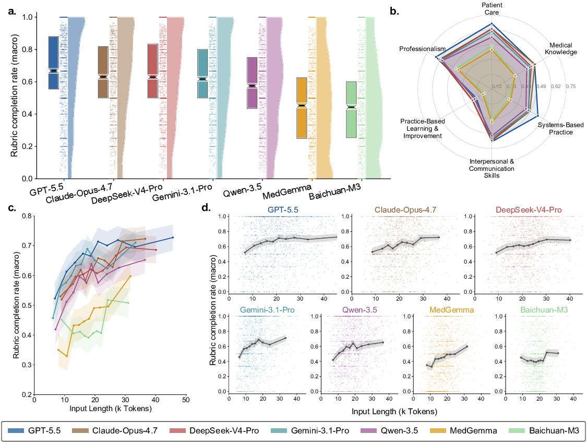

# MedSP1000

### Evaluating Large Language Models in Dynamic Clinical Decision-Making with Standardized Patient Cases

[](https://arxiv.org/abs/XXXX.XXXXX)
[](https://your-project-page.github.io)
[](LICENSE)

> Cheng Liang\*, Pengcheng Qiu\*, Ya Zhang, Yanfeng Wang, Chaoyi Wu†, Weidi Xie†
> <br/>Shanghai Jiao Tong University · Shanghai Artificial Intelligence Laboratory
> <br/><sub>\* Equal contribution&nbsp;&nbsp;† Corresponding author</sub>

This repository is the official implementation of
[**MedSP1000**](https://arxiv.org/abs/XXXX.XXXXX).

---

## Abstract

Large language models (LLMs) are increasingly proposed as clinical agents, yet
static, single-turn benchmarks cannot capture how a model **dynamically delivers
care across an encounter**: gathering information, planning treatment, and adapting
longitudinal management across successive patient states. Medical education has
long addressed an analogous challenge through **standardized patients (SPs)** —
trained actors who consistently portray clinical cases for safe, quantifiable
assessment.

We introduce **MedSP1000**, an SP-derived interactive benchmark for clinical-agent
evaluation. It converts peer-reviewed SP teaching cases into executable scenarios
with defined patient scripts, clinical environment contexts, and a human-validated
structured rubric. In each run, a **clinician agent** interacts in closed loop with
a **patient agent** and an **environment controller**, and its behaviour is scored
throughout the encounter against expert criteria from the original materials.

Applying MedSP1000 to general-purpose and medically specialized LLMs, we find that
strong static-benchmark performance does **not** reliably transfer to interactive
care: the best model (**GPT-5.5**) completes only **60.4%** of expert-defined rubric
items, the strongest medically specialized model reaches only **40.0%**, and extra
test-time compute produces no measurable gain.

<p align="center">
  
</p>

## Highlights

- 🏥 **SP-grounded** — built directly on peer-reviewed [MedEdPORTAL](https://www.mededportal.org/) teaching materials (1,073 source articles, 22,244 attachments).
- 🔁 **Interactive, multi-turn** — closed-loop encounters between a clinician agent, a patient agent, and an environment controller, with a standardized state-transition protocol.
- 📊 **Scale & breadth** — **1,638 interactive cases** across **17 clinical specialties**, scored with **24,602 rubric items**.
- 🧭 **ACGME-aligned scoring** — every action graded against a frozen rubric over the **6 ACGME core competencies** (PC, MK, SBP, ICS, PBLI, PROF).
- 👩‍⚕️ **Human-validated** — cases and trajectories checked by 12 clinicians (each independently double-scored).

## Framework

MedSP1000 has three stages: **(a)** an agentic data-processing pipeline that turns
heterogeneous MedEdPORTAL materials into role-specific scenario packets; **(b)** a
multi-agent evaluation loop over multiple clinical states; and **(c)** an evaluator
agent that scores the full trajectory against the rubric across the six ACGME
competencies.

<p align="center">
  
</p>

## Results

Performance on static benchmarks does not reliably translate to interactive clinical
care. The strongest general model leads the strongest medically specialized model by
**20.4 points** in overall rubric completion.

<p align="center">
  
</p>

| Model | Overall rubric completion |
| ----- | ------------------------- |
| GPT-5.5 (best general)              | **60.4%** |
| Best medically specialized model    | 40.0% |

> 📋 *Replace with the full Table 1 (per-competency PC/MK/SBP/ICS/PBLI/PROF, micro/macro, 95% CIs). Per-specialty and test-time-compute results are in `assets/results-3.png` and `assets/tts-sub.png`.*

## Repository Structure

```
paper-release/
├── src/        # core simulation + evaluation code (clinician / patient / environment / evaluator agents)
├── configs/    # model & pipeline configuration files
├── scripts/    # data-processing, run, and analysis entry points
├── docs/       # extended documentation
└── assets/     # figures
```

## Requirements

```setup
conda create -n medsp1000 python=3.10
conda activate medsp1000
pip install -r requirements.txt
```

> 📋 *Set provider credentials via environment variables (e.g. `OPENAI_API_KEY`,
> `DEEPSEEK_API_KEY`, `MEDGEMMA_BASE_URL` for local vLLM). List any non-pip
> dependencies (model weights, cluster setup) here.*

## Data

MedSP1000 is derived from MedEdPORTAL teaching materials.

> 📋 *Describe how to obtain the released scenarios and the expected directory
> layout (each scenario holds materials for the four role agents), and link the
> data release here.*

```data
python scripts/generate_scenario_directories_json.py --pretty
```

## Running the Benchmark

```eval
bash scripts/run_simulate_cases.sh \
    --case-file scenario_directories_full.json \
    --examinee-model <CLINICIAN_MODEL> \
    --sp-env-eval-model <JUDGE_MODEL> \
    -j <CONCURRENCY>
```

Each run produces per-turn transcripts, agent logs, and a
`final_evaluation_frozen_rubric.json` scored over the six ACGME competencies. Runs
are idempotent and resumable via status markers.

> 📋 *Document each flag and the optional test-time-compute strategies
> (`--examinee-tts {off|single|bon|medagents}`).*

## Citation

```bibtex
@article{liang2026medsp1000,
  title   = {MedSP1000: Evaluating Large Language Models in Dynamic Clinical Decision-Making with Standardized Patient Cases},
  author  = {Liang, Cheng and Qiu, Pengcheng and Zhang, Ya and Wang, Yanfeng and Wu, Chaoyi and Xie, Weidi},
  journal = {<Venue>},
  year    = {2026},
  url     = {https://arxiv.org/abs/XXXX.XXXXX}
}
```

## License

Released under the [MIT License](LICENSE).

## Acknowledgements

Source cases are drawn from [MedEdPORTAL](https://www.mededportal.org/). Scoring
follows the [ACGME Core Competencies](https://www.acgme.org/). The test-time-compute
study adapts the [MedAgents](https://github.com/gersteinlab/MedAgents) framework.
